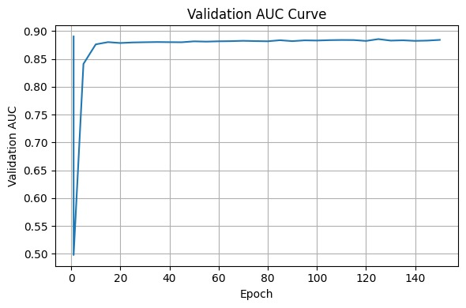

# Unified Biomedical Knowledge Graph Integration and Ultra-GCN Based Drug Repurposing

This research project focuses on Cross Drug Repurposing to accelerate therapeutic discovery by identifying new treatment potentials for existing drugs. By uncovering hidden relationships across drug–gene–disease networks, the system supports faster, data-driven identification of repurposable drugs, reducing research time in the search for novel therapies.
## Knowledge Graph Sources

The five biomedical knowledge graphs utilized in this project are stored within the repository and can be accessed directly below:

- **Drug–Disease Knowledge Graph**  
  Captures known therapeutic relationships between drugs and diseases  
  🔗 [View Dataset](https://github.com/riddima15benjamin/kgs_ugcn)

- **Gene–Disease Knowledge Graph**  
  Represents genetic associations underlying disease mechanisms  
  🔗 [View Dataset](https://github.com/riddima15benjamin/kgs_ugcn)

- **Drug–Gene Knowledge Graph**  
  Encodes drug-target interactions and pharmacological effects  
  🔗 [View Dataset](https://github.com/riddima15benjamin/kgs_ugcn)

- **Protein–Protein Interaction (PPI) Knowledge Graph**  
  Models biological pathways and molecular interactions  
  🔗 [View Dataset](https://github.com/riddima15benjamin/kgs_ugcn)

- **Biomedical Ontology / Annotation Knowledge Graph**  
  Provides semantic enrichment through controlled vocabularies and hierarchical relationships  
  🔗 [View Dataset](https://github.com/riddima15benjamin/kgs_ugcn)

  ## 3. System Architecture

The proposed system is designed as a modular pipeline integrating data engineering and graph learning components.

### Pipeline Overview

| Module | Function |
|--------|---------|
| Preprocessing | Cleans and standardizes biomedical datasets |
| KG Construction | Builds structured graphs from raw data |
| KG Integration | Merges heterogeneous graphs into a unified network |
| Ultra-GCN | Learns embeddings efficiently at scale |
| Prediction | Identifies potential drug–disease links |

## Results and Training Convergence

The training process demonstrated consistent and stable convergence, indicating effective optimization and strong generalization performance.

### Training Metrics
- **Initial Loss:** 0.0781  
- **Final Loss:** 0.0023  
- **Validation AUC:** Improved from **0.5515 → 0.8891**

### Validation AUC Curve

### Analysis
- Rapid improvement in AUC during early epochs suggests efficient learning of graph representations  
- Gradual stabilization indicates convergence without significant overfitting  
- Final AUC of ~0.89 reflects strong predictive capability for drug–disease link prediction  
- Loss reduction confirms effective parameter optimization and model stability  

Overall, the model achieves a balance between accuracy and computational efficiency, making it suitable for large-scale biomedical graph analysis.

